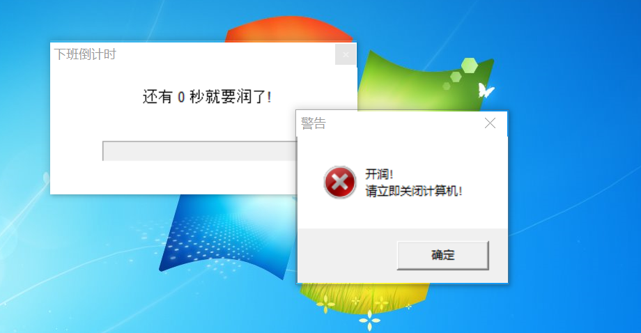

# Leave Work Reminder

到时间就要下班，老板不爱你的！



## 介绍

值此五一佳节，为了庆祝996连续工作12天从而换得五天假期，去纪念工人获得八小时工作制的节日，特意写了这个小工具。

它会在你下班时间到达之际，弹出一个窗口提醒你应该润了，因为不润的话，不仅没有加班工资，而且加班时长不一定能变成调休。

## 编译（Windows环境 + MSYS2）：

```powershell
gcc leaveWork_task.c -o leaveWork_task.exe -ladvapi32 -lcomctl32 -lgdi32 -luxtheme -lgdiplus -mwindows
```

> 注意：使用-mwindows而不是-mconsole

## 创建计划任务

- 打开任务计划程序（搜索"任务计划程序"）
- 创建基本任务 → 输入名称"下班提醒"
- 触发器：每天，如果每天下班时间是18:30，那么选择特定时间 18:28
- 操作：启动程序，浏览选择您的 leaveWork_task.exe
- 完成设置

## 附加选项（可选）

- 编辑任务 → 勾选"使用最高权限运行"
- 条件选项卡 → 取消勾选"只有在计算机使用交流电源时才启动任务"

## 使用方法

- 安装计划任务:

```powershell
.\create_task.ps1 -install
```

- 指定时间安装计划任务:

```powershell
.\create_task.ps1 -install -time "18:28"
```

- 卸载计划任务:

```powershell
.\create_task.ps1 -uninstall
```

- 交互式使用(无参数):

```powershell
.\create_task.ps1
```
> 脚本会显示帮助信息，然后询问您是否要安装任务并允许自定义时间。

建议使用管理员权限运行此脚本，以确保任务计划程序权限足够。

## 兼容性（测试过的操作系统）

- [ ] Windows XP 64位
- [ ] Windows 7 64位
- [ ] Windows 8/8.1 64位
- [x] Windows 10 64位
- [ ] Windows 11 64位


## Todo

- [x] 自动弹出贪吃蛇、俄罗斯方块等小游戏
- [ ] 到时间自动关机
- [ ] 其他平台支持（Linux、MacOS）
- [ ] <s>其他语言支持（Python、Java、Go、Rust等）</s>

## 已完成的功能

- [x] 自动<kbd>Ctrl</kbd>+<kbd>S</kbd>保存当前工作
- [x] 屏幕截图（全屏）

## Reference

- [Windows API](https://learn.microsoft.com/en-us/windows/win32/apiindex/windows-api-list)
- [Windows Task Scheduler](https://learn.microsoft.com/en-us/windows/win32/taskschd/task-scheduler-start-page)
- [Windows GDI+](https://learn.microsoft.com/en-us/windows/win32/gdi/windows-gdi)
- [shlobj.h header](https://learn.microsoft.com/en-us/windows/win32/api/shlobj/)

## 许可协议

[MIT](https://github.com/IcingTomato/LeaveWorkReminder/blob/master/LICENSE)

## Bugs Fixes

- [x] 解决了多显示器/高分屏下截图不全的问题（DPI感知问题）[e026e3b](https://github.com/IcingTomato/LeaveWorkReminder/commit/e026e3b39eba0b5f276b44e0e9e63439d03b5067)
