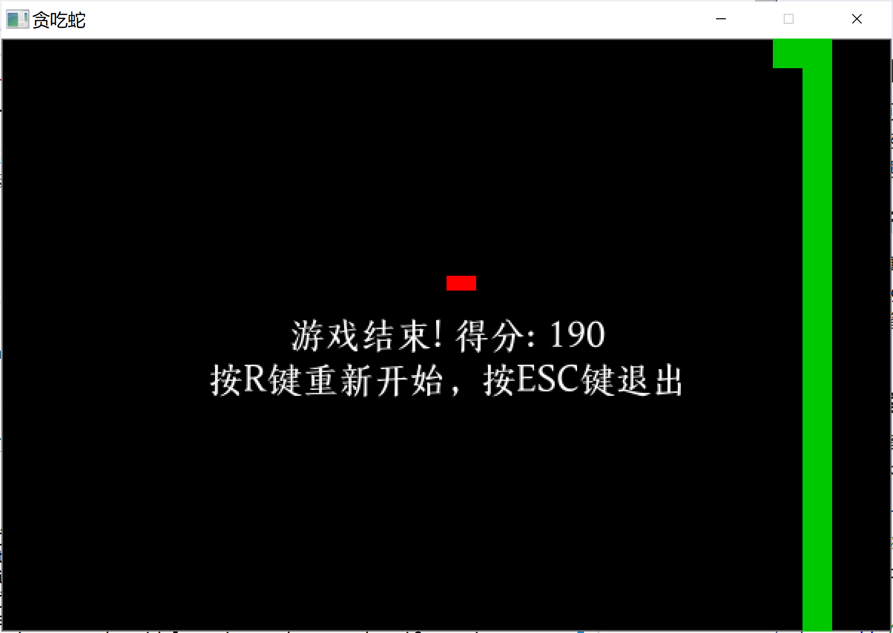

# Snake 贪吃蛇



## 编译

```powershell
gcc snake.c -o snake -IC:/msys64/ucrt64/x86_64-w64-mingw32/include/SDL2 -LC:/msys64/ucrt64/x86_64-w64-mingw32/lib -lmingw32 -lSDL2main -lSDL2 -lSDL2_ttf -mwindows
```

## 环境搭建

### 下载 SDL2

- [SDL2](https://github.com/libsdl-org/SDL/releases/tag/release-2.32.4)
- [SDL2_ttf](https://github.com/libsdl-org/SDL_ttf/releases/tag/release-2.24.0)

需要下载 `SDL2-devel-2.32.4-mingw.zip` 和 `SDL2_ttf-devel-2.24.0-mingw.zip` 这两个文件。

### 解压复制

解压后进入 `\SDL2-devel-2.32.4-mingw.zip\SDL2-2.32.4` 目录下，复制 `x86_64-w64-mingw32` 这一整个目录到 `C:\msys64\ucrt64\` 目录下，最终路径为 `C:\msys64\ucrt64\x86_64-w64-mingw32`。

然后顺带把 `\SDL2-devel-2.32.4-mingw.zip\SDL2-2.32.4\x86_64-w64-mingw32\bin` 目录下的 `SDL2.dll` 复制到 `snake.exe` 目录下。

`SDL2_ttf-devel-2.24.0-mingw.zip` 处理方式同上。

## 字体

默认：[上图东观体](https://www.library.sh.cn/special/dongguanti/)

## 玩法

方向键控制

## 许可协议

[MIT](https://github.com/IcingTomato/LeaveWorkReminder/blob/master/src/snake/LICENSE)

## Bugs Fixes

- [x] 解决了在🐍吃到🍎后，屏幕会闪烁一下暗戳戳显示游戏开始界面的问题。